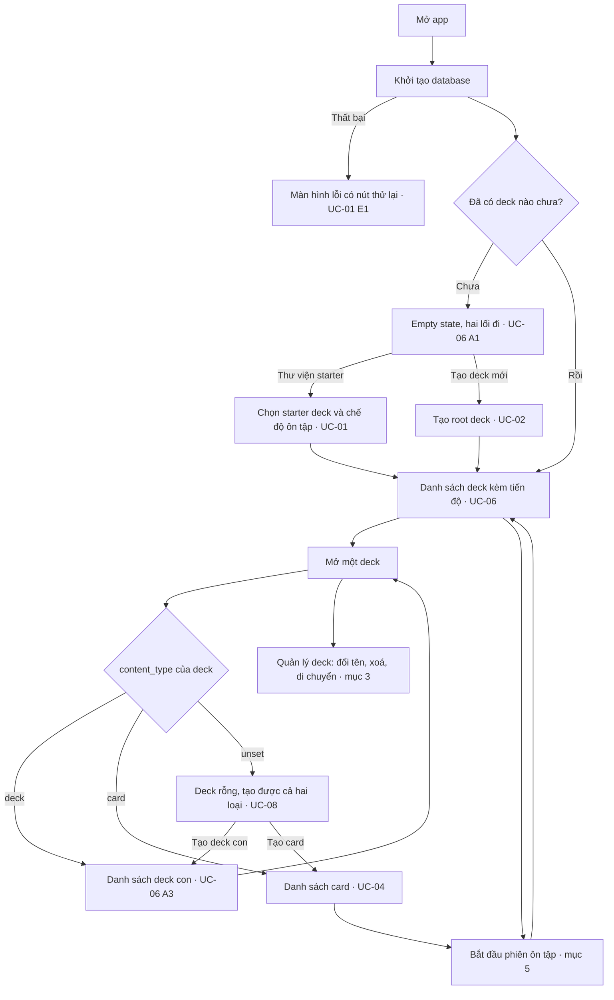
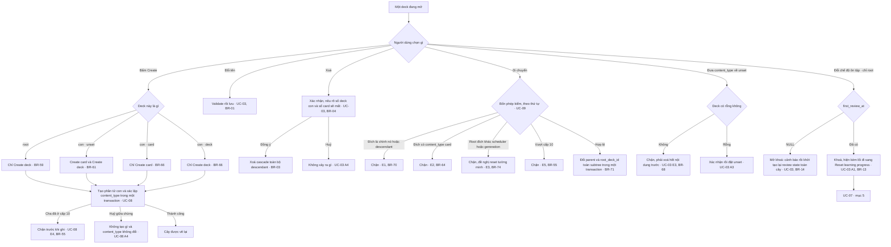
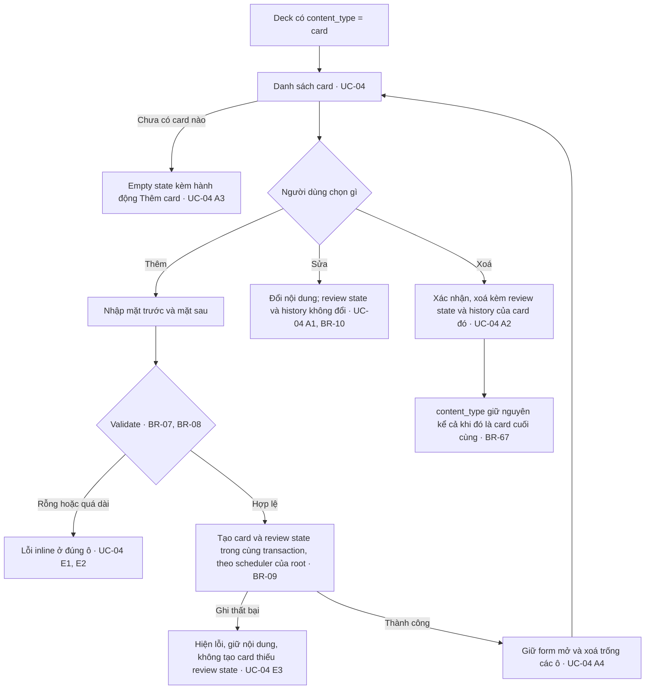
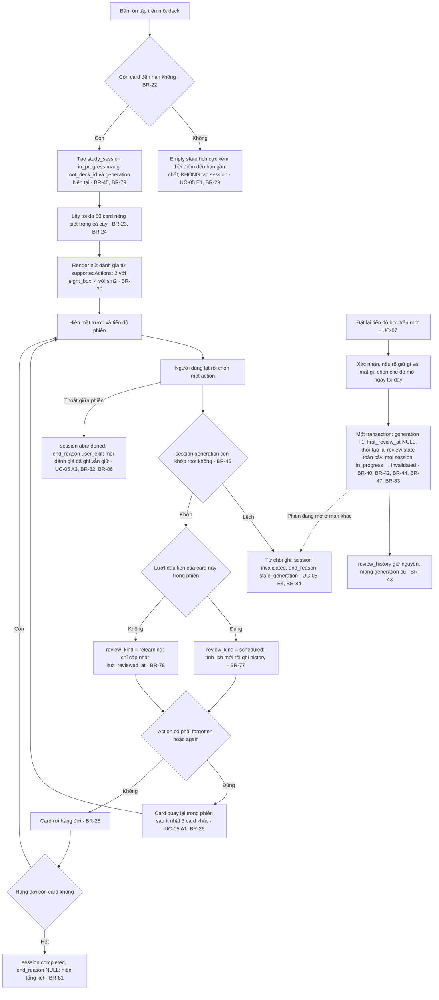

# Master flow — memox (MVP)

| | |
|---|---|
| **Status** | active |
| **Purpose** | Cho thấy các use case nối vào nhau thành hành trình nào, thứ mà đọc từng UC riêng lẻ không thấy được |
| **Scope** | Đồ thị chuyển tiếp giữa UC-01…UC-09, tách theo đối tượng nghiệp vụ. Ngoài phạm vi: nội dung của từng UC, mọi luật nghiệp vụ, và mọi chi tiết màn hình |
| **Source of truth for** | Đồ thị chuyển tiếp giữa các UC · điểm vào của từng luồng · ánh xạ UC → milestone xây nó |
| **Depends on** | `document-conventions.md`, `product.md`, `business-rules.md`, `use-cases.md` |
| **Updated by task** | M99.1 |
| **Last updated** | 2026-08-07 |

---

## 1. Tài liệu này là gì, và không là gì

`use-cases.md` đặc tả **từng** UC đầy đủ chín mục. Nó cố ý không vẽ đồ thị nối
chúng lại, nên câu "sau khi tạo deck xong thì người dùng đi đâu" không có chỗ nào
trả lời — mỗi UC tự mô tả mình và im lặng về những UC bên cạnh.

Tài liệu này chỉ giữ **các cạnh của đồ thị đó**. Mọi đỉnh đều trỏ về một UC hoặc
một BR bằng ID.

**MUST NOT** đọc sơ đồ ở đây như một đặc tả. Theo `document-conventions.md` §5,
luật nghiệp vụ sống ở `business-rules.md` và luồng sống ở `use-cases.md`; nhãn
trong sơ đồ là **rút gọn để đọc được**, không phải bản gốc. Khi sơ đồ và UC/BR
mâu thuẫn, **UC/BR thắng**, và sơ đồ sai là một defect phải sửa.

**Tách theo đối tượng, không theo hành động.** Mục 3–5 chia theo *deck*, *card*,
*review* — không có mục riêng cho "tạo deck" hay "xoá deck". Một tài liệu cho mỗi
hành động sẽ nhân số file theo số nút bấm, và phần lớn chúng sẽ chỉ có một sơ đồ
ba đỉnh.

---

## 2. Master flow — toàn app

Hành trình từ lúc mở app tới lúc vào được một phiên ôn tập. Nhánh nào đi sâu vào
một đối tượng thì dừng ở đó và tiếp tục ở mục tương ứng.

**`J --> H` là vòng lặp cố ý.** Deck lồng tới 10 cấp (BR-55) và một cấp bất kỳ
lại là "mở một deck" của cấp trên nó; màn hình là **một** màn đệ quy chứ không
phải hai màn khác nhau cho root và cho deck con.

---

## 3. Deck

Mọi thao tác trên cây deck. Điểm vào là một deck bất kỳ đang mở.

**Nhánh `I` là chỗ hai đối tượng gặp nhau.** Chế độ ôn tập là thuộc tính của deck
nhưng bị khoá bởi một sự kiện của review, nên đường thoát duy nhất khi đã khoá
nằm ở mục 5. Ẩn nó đi thay vì hiện trạng thái khoá là điều BR-13 cấm.

---

## 4. Card

Điểm vào là một deck đã có `content_type = 'card'` (BR-63). Card **đầu tiên** của
một deck `unset` không đi qua đây — nó được tạo ở UC-08 và chính nó xác lập
`content_type`.

**`I1` là cạnh dễ vẽ sai nhất trong tài liệu này.** Xoá hết card **không** đưa
deck về `unset`; muốn đổi loại phải qua nhánh `H` ở mục 3, và đó là một hành động
được xác nhận riêng (BR-68).

---

## 5. Review

Hai UC dùng chung một đối tượng: phiên ôn tập (UC-05) và việc đặt lại tiến độ học
(UC-07). Chúng nằm chung mục vì generation là thứ nối chúng — và là thứ khiến một
phiên đang mở có thể bị vô hiệu hoá từ màn khác.

**Cạnh nét đứt `T -.-> H1` là lý do hai UC này ở chung một mục.** Reset chạy ở màn
hình A làm mọi phiên đang mở ở màn hình B hết hiệu lực; người dùng ở B chỉ biết
điều đó khi bấm đánh giá lần tiếp theo. Đọc riêng UC-05 hoặc riêng UC-07 đều không
thấy được cạnh này.

---

## 6. UC nào được xây ở đâu

Ánh xạ UC → milestone. **Trạng thái của milestone sống ở `wbs.md`**, không lặp
lại ở đây; cột cuối chỉ nói cái gì đã có trong `lib/` hôm nay, vì đó là thứ sơ đồ
ở trên không thể hiện.

| UC | Đối tượng | Xây ở | Có trong `lib/` hôm nay |
|---|---|---|---|
| UC-01 | deck | M4.12a | Template tự cài lúc khởi động qua `app/startup/fixture_seeder_widget.dart`. **Màn thư viện để người dùng duyệt template và chọn chế độ ôn tập cho bản sao thì chưa có** — bước 4–7 của UC-01 |
| UC-02 | deck | M4.10 | Đủ |
| UC-03 | deck | M4.10 | Đổi tên, xoá kèm impact, đưa `content_type` về `unset` đã có. **Đổi chế độ ôn tập chưa có** — không có use case nào cho nó |
| UC-04 | card | M4.11 | Đủ, và **nhiều hơn UC-04 mô tả**: cờ, tag và ba trường phụ (BR-92…BR-95) |
| UC-05 | review | M5 | Chưa xây. `lib/features/review/` mới có một repository chưa có method và một placeholder screen |
| UC-06 | deck | M4.10 | Đủ, cộng tìm kiếm toàn subtree — thứ UC-06 không nhắc tới |
| UC-07 | review | M5 | Chưa xây |
| UC-08 | deck | M4.10 | Đủ |
| UC-09 | deck | M4.10 | Đủ |

### Ba chỗ tài liệu và code đã lệch

Ghi lại chứ **không** sửa ở đây: cả ba đều thuộc `use-cases.md`, đang
`frozen for MVP`, và M99.1 không có quyền sửa nó ngoài dòng trỏ sang tài liệu này.

1. **UC-04 không nhắc cờ và tag.** BR-93 và BR-95 khai `Related: UC-04`, nhưng
   dòng `Business rules` của UC-04 chỉ liệt kê BR-07…BR-10, BR-63, BR-67. Tham
   chiếu một chiều: BR biết UC, UC không biết BR.
2. **UC-06 không nhắc tìm kiếm.** `search_decks_use_case.dart` tồn tại và màn
   danh sách có ô tìm kiếm toàn thư viện; UC-06 xếp tìm kiếm card vào mục "cố ý
   không đặc tả" (S1) và không nói gì về tìm deck.
3. **UC-01 mô tả một màn thư viện chưa tồn tại.** Phần đã xây là seed tự động cho
   demo, không phải luồng người dùng chọn. Hai thứ này khác nhau ở chỗ ai quyết
   định `scheduler_type` của bản sao.
